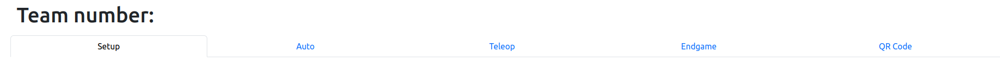
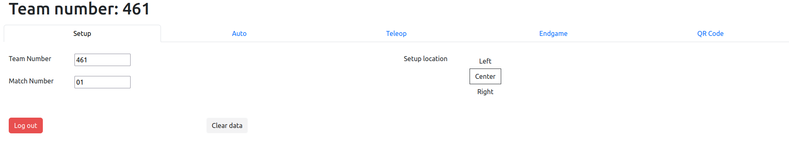
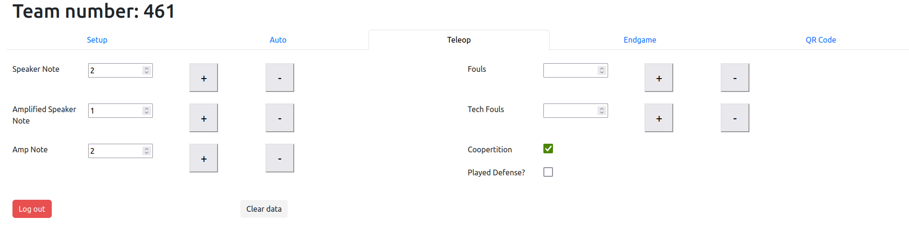
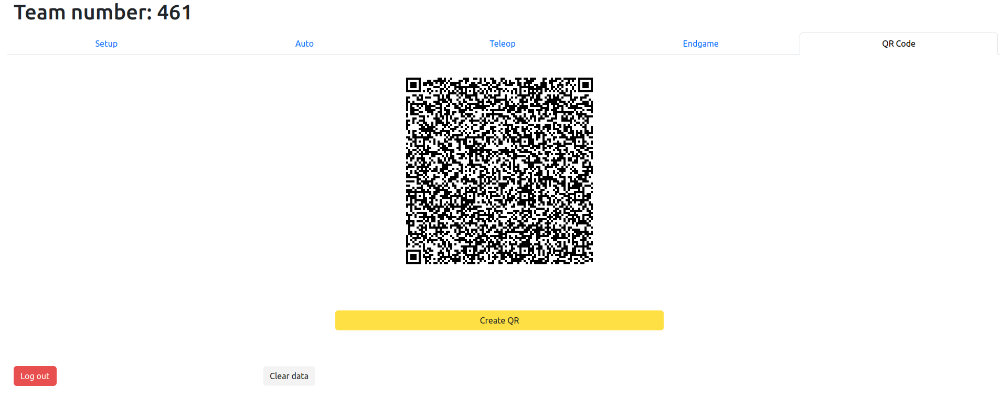

# Quick Start

This guide will give you a quick start on how THE Scouting System works and how to use it during tournaments.

## Signing In

There are two types of scouting accounts, the `Scout Master` and `Pit Scouters`. If you have no idea what the difference between those two of those are, then you probably should use the `Pit Scouters` account.

Credentials will be given to you during the tournament.

> [!NOTE]
> The following guide will go through steps that will apply to both `Pit Scouters` and the `Scout Master`. For an in-depth documentation on how to use the `Scout Master` account, visit the [Scout Master docs](SCOUTMASTER.md).

## Pre-Scouting Check-List

- [ ] Are you in a spot where the game is visible?
- [ ] Are you able to see the bumpers numbers on the robots?
- [ ] Are you scouting a different team than your teammate?

If you satisfy all the requirements, move on to scouting!

## Scouting

> [!WARNING]
> The following screenshots shows THE Scouting system for the 2024 season. Name of events may change due to each years event being different.

Click the `Scout` button on the bottom right to start scouting.

### Setup

In the `setup` tab, you will be able to enter information about the team number, match number, and the start location of their robot.

The team and match number should both be integers.

### Recording Match Data

There are three tabs corresponding to the three stages of a match: `Auto`, `Teleop`, and `Endgame`.

Different stages of the game will have different components of the game to keep track of. For example, during the 2024 Crescendo Season, the `Teleop` section has an entries called `Speaker Notes` and `Amp Notes`. 

In the `Endgame` tab, there is a text box for extra notes. These notes are optional, but if you see anything that you think would be useful for the evaluation of teams, include it.

### Transferring Data to the Scout Master Device

After recording all the data, navigate to the `QR Code` tab. Here you can generate a QR Code that the Scout Master device can scan and import the data from. 

Pressing the `Create QR` button will create the QR Code as well as download a copy of itself and the data on to your device. This is to ensure that the data wouldn't be lost in case an emergency occurs.

After the data has been transferred/downloaded, you can press the `Clear data` button to clear the data and start scouting another match!
