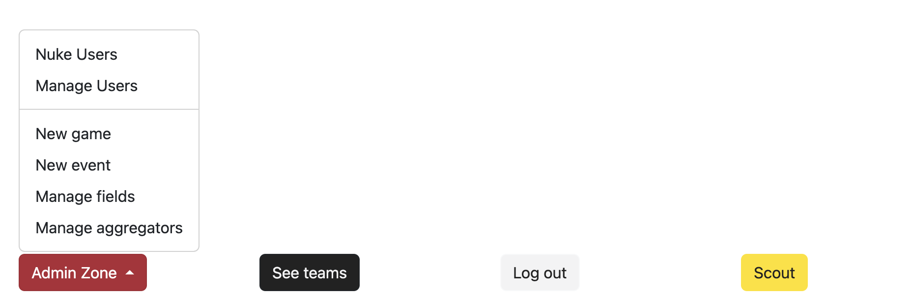
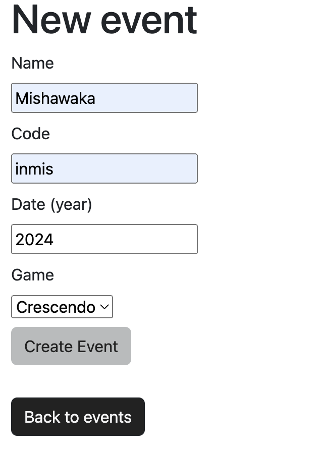
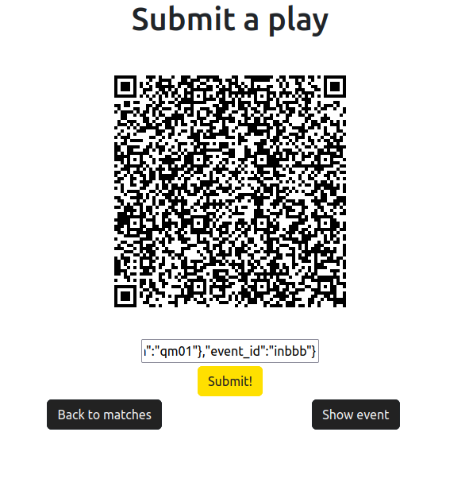

# Scout Master Documentation

> [!WARNING]
> If you are not the Scout Master, this piece of documentation would not be very helpful for you. 
> 
> If you wish to read on, feel free to do so. 
> If you are here for general scouting, checkout the [Quick Start Guide](QUICK_START.md)

## Setting Up a New Game

Go to `Admin Zone` and click `New Game`, then enter the name of the game for the season.

## Setting Up a New Event

Go to `Admin Zone` and click `New Event`. Enter the `name`, `code`, and `date` to create a new event. (Make sure you select the correct `Game`).

The `code` should be the 5-letter code from [The Blue Alliance](https://www.thebluealliance.com/) (TBA).

## Setting Up Matches

Click the `Data` button and press `Import Matches from TBA` to import the matches and teams for the event.

## During the Event

Click on `matches` and assign teams to scouters based on the schedule.

## Submitting Data

In `matches`, scroll down and click `Add QR Data` to access the QR form page. Use the QR scanner to scan the QR code and submit the JSON data. 

> [!WARNING] 
> Check if the JSON is valid before submitting. 
> 
> Make sure the `match_num` matches the actual `match_num`. For example, if match is `qm01`, then `match_num` should be `qm01` and not `qm1`

After submitting the data, you can review it in several places:
- `Show Match`: To view data for that specific match.
- `Data`: To check performance data for all teams.
- `Team`: To view data for a specific team.

> [!NOTE]
> If data is lost due to human error or technical issues, flag the match with incomplete data. 

## Editing Matches (Not necessary)

~~This can be tedious and a bit unnecessary~~
Enter the `Score` and `RP` (Ranking Points) for the Red and Blue Alliances (Scores aren’t as important, but RP is).

After entering the scores, you can view the team rankings from the **Team Ranking Table** (Note: The link isn’t directly available, so you must enter the URL)
- Ranking Table Path: `events/[event_code]/ranked_teams`
- Teams will be ranked based on their average RP.

## After Collecting the Data

Go to the `Data` section to view the data for all teams. You can find several export options at the bottom, such as `Download CSV` and `Download raw data`.

## Path Scouting
This feature is still under development.
